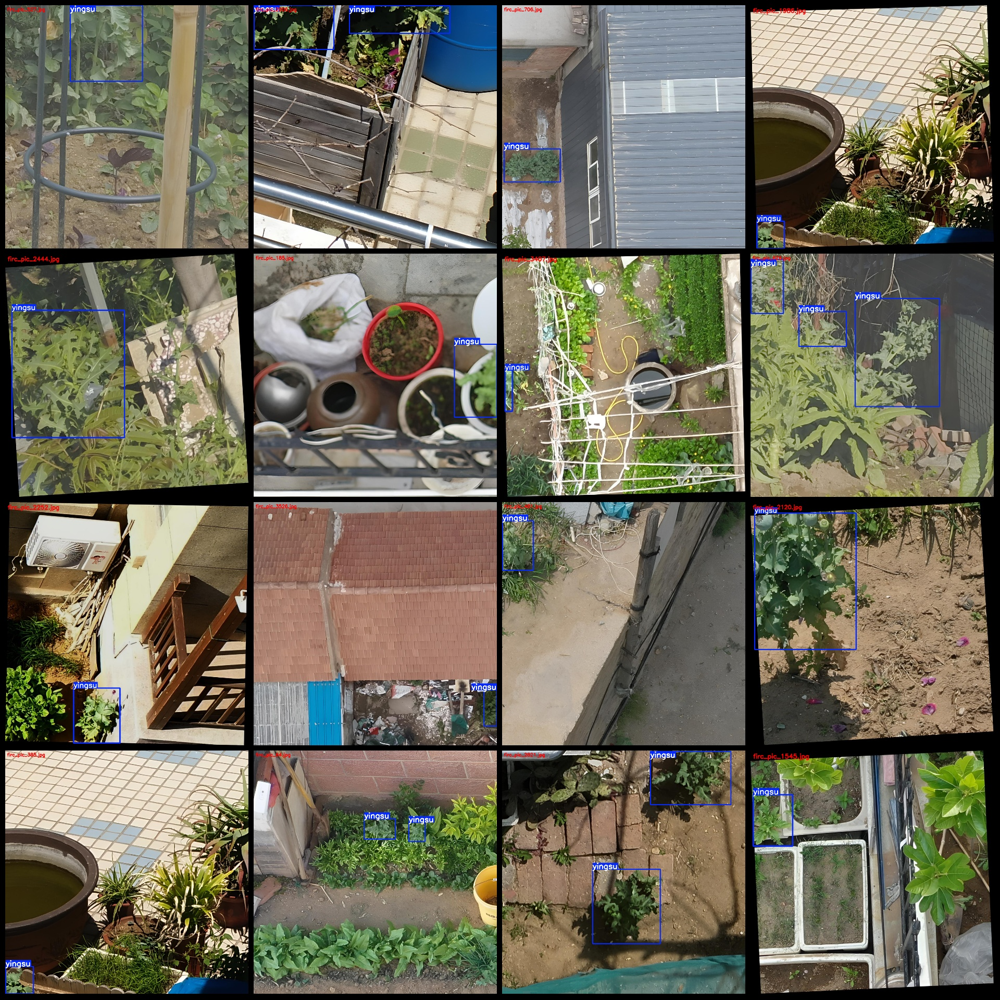
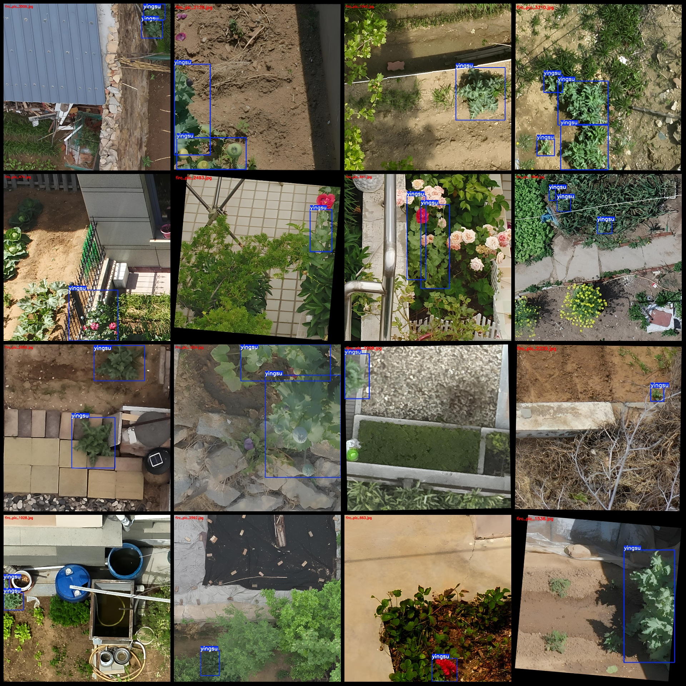

# Drone Perspective Illicit Drugs Detection Dataset VOC+YOLO Format with 3648 Images and 1 Category

Please note that the dataset mainly contains enhanced images, primarily rotation enhancements, which accounts for about half of the data volume. Please review the images carefully.
The dataset format is Pascal VOC with YOLO format (excluding the split path's txt file, only containing jpg images along with corresponding VOC format xml files and YOLO format txt files).
Number of images (number of jpg files): 3648
Number of labels (number of xml files): 3648
Number of labels (number of txt files): 3648
Number of label categories: 1
Label category name: "yingsu"
Number of bounding boxes per category:
- "yingsu" bounding box count = 6066
- Total bounding box count = 6066
- Number of images per category:
- "yingsu" images per category = 3648
Image resolution: Images are of multiple resolutions, such as 988x988, 1280x1280, etc.
Annotation tool used: labelImg
Annotation rules: Rectangles are drawn around the category
Important note: The dataset does not have a training validation test split; you will need to divide it yourself.
Special declaration: This dataset does not guarantee the accuracy of the trained models or weight files.
Image preview:
Annotation example:

## Images

Here is a pay link on Stripe ( https://buy.stripe.com/3cs8yP7sY87d0vu9AB ). Please contact me lonlonago@foxmail.com after funding $89, and I will send you a complete data files , thank you!

